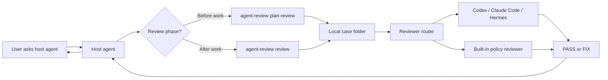

# agent-review

> Local multi-agent review gate for AI coding agents.

`agent-review` lets a host agent ask another agent to review a plan or final deliverable before it continues. It is local-first, file-based, and designed for Codex, Claude Code, Hermes, or any CLI agent that can run shell commands.


## Why

AI coding agents are fast, but they can miss boring failure cases:

- the plan is too vague before execution
- source files changed without tests
- a final answer says "done" while evidence is missing
- secrets or `.env` changes slip into a diff
- a reviewer agent fails, and the host agent needs a safe fallback

`agent-review` adds a small review checkpoint without requiring a server, database, or hosted account.

## What It Does



Two review modes are supported:

- **Plan review**: before execution, review the host agent's proposed plan.
- **Delivery review**: after execution, review changed files, test evidence, and final response text.

The reviewer only reviews. The host agent still decides what to adopt and sends the final user-facing response.

## Install

Use Python 3.9 or newer:

```bash
git clone https://github.com/kelin3296-jpg/agent-review.git
cd agent-review
python3 -m pip install .
agent-review --help
```

If editable installs are awkward on your machine, use the repo-local wrapper:

```bash
chmod +x ./agent-review
bash ./agent-review --help
```

Initialize config in a project:

```bash
agent-review init-config --project-path /path/to/your/project
agent-review init-config --global-config
```

This creates:

- project config: `/path/to/your/project/agent-review.json`
- global config: `~/.agent-review/config.json`

## Install With An Agent

If you want another AI agent to install this project for you, copy the prompt in [docs/INSTALL_WITH_AGENT.md](docs/INSTALL_WITH_AGENT.md) and send it to that agent.

Short version:

```text
Install https://github.com/kelin3296-jpg/agent-review as a local CLI.
Use Python 3.9+, run tests, initialize global config, and add the manual review rules from templates/core-rules/ to the active agent instruction file if appropriate.
Do not enable automatic hooks unless I explicitly ask for that.
```

## Quick Start

Plan review:

```bash
agent-review plan-review \
  --host codex \
  --project-path /path/to/project \
  --task-text "Add a login retry flow" \
  --plan-text "Update the auth service, add retry UI state, and test failed login retry behavior." \
  --json
```

Delivery review:

```bash
agent-review review \
  --host codex \
  --project-path /path/to/project \
  --task-text "Fix a login button bug" \
  --final-response-text "Fixed the login button and verified the flow." \
  --json
```

If the target project is a Git repository, `agent-review` can collect changed files and diff context automatically. You can also pass explicit files:

```bash
agent-review review \
  --host claude-code \
  --project-path /path/to/project \
  --changed-files /tmp/changed-files.txt \
  --tests-log /tmp/tests.log \
  --json
```

## Manual Trigger Rule

The recommended MVP flow is manual:

- Before execution: use `agent-review plan-review`.
- After execution or after a deliverable exists: use `agent-review review`.
- Do not run review automatically just because a task changed files.
- Trigger review only when the user asks for review or uses agreed review keywords.

The templates in [templates/core-rules](templates/core-rules) contain ready-to-paste rules for:

- Codex: [codex-AGENTS-snippet.md](templates/core-rules/codex-AGENTS-snippet.md)
- Claude Code: [claude-CLAUDE-snippet.md](templates/core-rules/claude-CLAUDE-snippet.md)
- Hermes: [hermes-SOUL-snippet.md](templates/core-rules/hermes-SOUL-snippet.md)

Hook examples are included in [templates/hooks](templates/hooks), but they are intentionally optional.

## Output

Review output is `PASS`, `FIX`, or `SKIP`.

Example JSON:

```json
{
  "case_id": "260625-001",
  "review_type": "delivery",
  "status": "FIX",
  "summary": "Source files changed without test evidence.",
  "severity": "normal",
  "can_deliver": false,
  "can_proceed": false,
  "reviewer": "local",
  "reviewer_kind": "builtin",
  "fix_instructions": [
    "Run focused tests or explain why tests could not be run."
  ]
}
```

Meaning:

- `PASS`: no blocking issue found.
- `FIX`: the host agent should repair or explain the issue before delivery.
- `SKIP`: review was not triggered.
- `severity: critical`: high-risk case such as failing tests, secret leakage, `.env` changes, auth, payment, database, or config risk.

## Local Case Files

Every review creates a local case folder in the target project:

```text
.agent-review/cases/<YYMMDD-001>/
  manifest.json
  review-brief.md
  review-result.json
  review-result.md
  README.md
```

`review-brief.md` is the default input for external reviewers. It contains bounded task, diff, test, and response context. Large logs are truncated. Runtime case folders are local artifacts and should not be committed.

If the target project is a Git repository, `.agent-review/` is added to `.git/info/exclude` automatically.

## Reviewer Routing

Default reviewer order:

| Host agent | Reviewer order |
|---|---|
| `claude-code` | `codex` -> `hermes` |
| `codex` | `claude-code` -> `hermes` |
| `hermes` | `codex` -> `claude-code` |

Built-in adapters:

- Codex: `codex exec`
- Claude Code: `claude -p`
- Hermes: `hermes chat`

If an external reviewer is unavailable, times out, or returns invalid JSON, `agent-review` falls back to the built-in policy reviewer.

## Config

`agent-review.json` example:

```json
{
  "knowledge_base_root": "",
  "sync_kb": false,
  "retention_days": 7,
  "reviewer_commands": {},
  "reviewer_adapters": {
    "codex": true,
    "claude-code": true,
    "hermes": true
  },
  "reviewer_timeout_seconds": 180,
  "reviewer_command_examples": {
    "codex": "built-in adapter: codex exec -C <project> -s read-only ...",
    "claude-code": "built-in adapter: claude -p --json-schema ...",
    "hermes": "built-in adapter: hermes chat -q ... -Q"
  },
  "privacy_masks": [".env", ".pem", ".key", "token", "secret"]
}
```

Notes:

- `knowledge_base_root` and `sync_kb` are compatibility fields; review records stay local by default.
- `retention_days` controls how long runtime case folders are kept.
- `reviewer_commands` lets advanced users override reviewer commands.
- `reviewer_adapters` enables built-in Codex, Claude Code, and Hermes adapters.
- Security preflight blocks `.env` and secret-like diffs before external reviewers can approve them.

## Development

```bash
python3 -m unittest discover -s tests -v
```

Repository layout:

```text
src/agent_review/          CLI and core logic
tests/                     unittest coverage
templates/hooks/           optional hook examples
templates/core-rules/      host-agent instruction snippets
docs/                      installation and architecture docs
```

## Status

This is an MVP for local-first review workflows:

- implemented: plan review, delivery review, local case files, retention cleanup, built-in policy review, external reviewer adapters
- not implemented: hosted service, UI, parallel multi-reviewer consensus

## License

MIT
